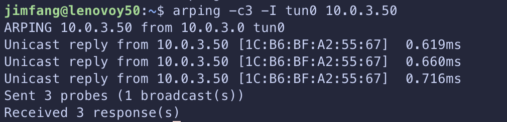

# Network Stack
Implentation of TCP handshakes from ethernet frames.

The original idea for this project was to implement a simple toy web server as inspired by [this](https://progbook.org/httpserv.html), however, things got away from me and it became something much more than just a HTTP server.

The ultimate goal is still to have this stack ping google.com or example.com on port 80 (so no SSL). See [To be implemented](#To-be-implemented) for a list of things that still need to be implemented for this to happen.

## Features
* Implementation of IEEE 802.3 ethernet frame parsing
* ARP
* IPv4
* ICMP
* TCP SYN-SYN/ACK handshake

  

## Setup
### Setup virtual network interface:
Setup a Linux TAP device to access L2 data. Bring up the TAP device like so:
```bash
# largely taken from this post: https://stackoverflow.com/questions/1003684/how-to-interface-with-the-linux-tun-driver

ip addr show # my eth0 inet address is 10.0.2.15/24 as Im running on a VirtualBox vm with Ubuntu 18.04 guest
sudo ip tuntap add mode tap dev tun0 # make sure the mode is tap and not tun!
sudo ip addr add 10.0.3.0/24 dev tun0  # give it an address (that does not conflict with existing IP)
sudo ip link set dev tun0 up  # bring the if up
ip route get 10.0.3.50  # check that packets to 10.0.3.x are going through tun0
# 10.0.3.50 dev tun0 src 10.0.3.0 uid 1000 
ping 10.0.3.50 # leave this running in another shell to be able to see the effect of the next example, nobody is responding to the ping
```

### C include path:
```
${workspaceFolder}/**
/usr/include/x86_64-linux-gnu
${workspaceFolder}/include
/usr/include
/usr/lib/gcc/x86_64-linux-gnu/13/include
```

### Compile:
`make`

The compiled binary is `/bin/main`

### Execution:
Check `src/main.c` for segmented tests.

### Configuring ARPing updates kernel ARP Table
Replace `<tuntap IF name>` with your IF name (tun0, tap0, etc)
`sudo bash -c 'echo 1 > /proc/sys/net/ipv4/conf/<tuntap IF name>/arp_accept'`

See: https://www.spinics.net/lists/netdev/msg314093.html & https://askubuntu.com/questions/783017/bash-proc-sys-net-ipv4-ip-forward-permission-denied

### Debugging
`tcpdump -i <tun/tap name> <specify protocol, leave empty for everything> -v`

With the above running, go to another terminal and run your command.

### To be implemented
* Full TCP RFC
* Sockets API
* Some sort of HTTP client (ex: a simple `curl` like tool that can send GET requests) - currently not planning to implement POST and the other HTTP requests.


### References
* Main inspiration & significant parts of the implementation from [saminiir's Level-IP](https://github.com/saminiir/level-ip/tree/master).
    * Associated blog posts:
        * https://www.saminiir.com/lets-code-tcp-ip-stack-1-ethernet-arp
        * https://www.saminiir.com/lets-code-tcp-ip-stack-2-ipv4-icmpv4/#internet-protocol-version-4
        * https://www.saminiir.com/lets-code-tcp-ip-stack-3-tcp-handshake/
* General context for the network stack / OSI model from [RFC 1180](https://datatracker.ietf.org/doc/html/rfc1180) & [TCP-IP Model article](https://www.geeksforgeeks.org/tcp-ip-model/).
* Some other general context resources:
    * https://users.rust-lang.org/t/implementing-my-own-tcp-stack/96759/3
    * https://www.youtube.com/watch?v=bzja9fQWzdA&list=PLqbS7AVVErFivDY3iKAQk3_VAm8SXwt1X
* Specifics for each function in resources.md and each individual source & header files.
